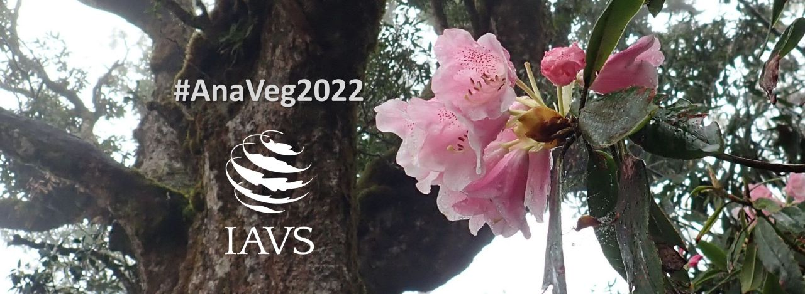

# #AnaVeg2022: Analysis of vegetation ecology data in R: ordination, clustering, diversity and traits
### An online workshop organized by the IAVS Young Scientists Working Group  

&nbsp;

**Instructors:** David Zelený (Taiwan)
**Teaching Assistant:** Po-Yu Lin 林柏佑 (Taiwan)

**Dates:** April 2022 (five Saturdays, each lecture 3-hours long, 11:00-14:00 UTC - [check time at your location](https://www.timeanddate.com/worldclock/fixedtime.html?msg=AnaVeg2022&iso=20220402T11&p1=1440&ah=3))

&nbsp;

### Workshop overview
This online workshop focuses on commonly used methods for the analysis of vegetation data, including ordination, classification, analysis of diversity and traits. We will provide brief theoretical background, demonstrate how to use these methods in R, how to read the R output and correctly interpret it, what are the common mistakes and how to avoid them. We will combine brief theoretical parts, which will introduce the concept behind each method, with practical examples using real vegetation datasets. All course materials will be available online. Lectures will be provided live on Zoom, with possibility for direct interactions between lecturers, assistant and participants. Each lecture will be also recorded, and the recording will be available to registered participants for further review.

Active attendees who succeeded to complete the course (with score > 70%) will obtain a Course Certificate issued by the IAVS and signed by instructors.

This is a paid online workshop for both IAVS members and non-members (see below for details about the registration fee). Maximum capacity is 30 participants. We offer registration waivers for those in financial need; to apply for waiver, please fill the [Request for registration waiver form](https://forms.gle/CySyCEbAvitkkzGg6) (up to 10 waivers are available, only for IAVS members). The budget collected from the registration fees will be used to cover the salary for the Teaching Assistant, and the rest will be used for activities of the IAVS Young Scientists Working Group.

### Location
Online, using the Zoom platform. The link will be shared with registered participants.

### Important dates
- Application request for registration waiver: March 18, 2022 (fill the [Request for registration waiver form](https://forms.gle/CySyCEbAvitkkzGg6), available only for IAVS members)
- Opening of workshop registration: March 21, 2022, 11:00 UTC, using the registration link on the IAVS website (https://www.iavs.org/event/anaveg2022; the link will be active after March 21, 11:UTC)
- Closing of workshop registration: on full capacity (30 seats, first come first served)
- start of workshop (first lecture): April 2, 2022, 11:00 UTC (Zoom link will be in the email confirming successful registration)

### Registration fee
- IAVS members - 30 USD
- others - 70 USD

Payment of the registration fee needs to be done by credit card during the registration (after March 21); if you wish to apply for registration waiver, make sure to submit the *Request for registration waiver form* (before March 18, you must be IAVS member). If you need to request bank transfer payment, please contact us in advance for arrangement. 

If you are not an IAVS member, please consider joining IAVS to obtain cheaper registration fee. Annual membership fee is 35 USD for regular members and 20 USD for students, with possible discounts and waivers for applicants with financial difficulties. IAVS membership brings further benefits, such as discounted registration fees for annual symposium, networking possibilities, publication discounts etc. More details on the [IAVS website](https://www.iavs.org/page/JoinIAVS).

If you are an IAVS member, when registering, you will be requested to log in into the https://iavs.org to obtain discounted registration fee for IAVS members. Please, make sure that you have your log-in credentials and that your membership is renewed. Best if you try to log in in advance here to ensure your loging credentials work: https://www.iavs.org/login.aspx

### What to prepare
Computer with installed R and RStudio, stable internet connection, headset and web camera for active participation. 

Before the course, please make sure that your computer has installed the latest version of R (version 4.1.2 or newer, installed from https://cran.rstudio.com/) and RStudio (2021.09.2, build 382 or newer, installed from https://www.rstudio.com/products/rstudio/download/). Check [here](https://anadat-r.davidzeleny.net/doku.php/en:r) for more details.

We expect you have basic skills in using the R programme, i.e. you know how to import libraries and data, create an object, subset object, create a loop and plot simple figures. If you are not familiar with R, we strongly suggest you complete [Quick R Introduction](https://www.davidzeleny.net/wiki/doku.php/quickr:start)** mini lectures before this workshop starts. 

### Preliminary programme
The workshop consists of five lecture blocks during April's Saturdays, each 3 hours long, with two 10-min breaks each. After each class, participants will get a homework assignment, with a deadline before the next class. We will also offer "Zoom office hours" for discussion with individual participants.

Date (2022) |Content of the lecture | Lecturer                                                 
------------|---------------------|--------- 
April 2, 11-14 UTC     |Introduction, types of data, ecological similarity and introduction to ordination        |David Zelený
April 9, 11-14 UTC     |Unconstrained and constrained ordination (PCA, DCA, RDA, CCA, tb-RDA, NMDS) |David Zelený
April 16, 11-14 UTC    |Classification of data and interpretation (TWINSPAN, hclust, fidelity measures)       |David Zelený
April 23, 11-14 UTC    |Analysis of diversity (diversity indices, rarefaction and extrapolation using iNEXT package)  |David Zelený
April 30, 11-14 UTC    |Practicing all types of analyses.                                                                           |David Zelený

### Contacts
  * David Zelený (lecturer), Associate Professor at National Taiwan University, Taiwan; zeleny@ntu.edu.tw, @zdealveindy
  * Po-Yu Lin (teaching assistant): graduated with Master's degree from National Taiwan University, Taiwan; flutter925517@gmail.com, @payo086
